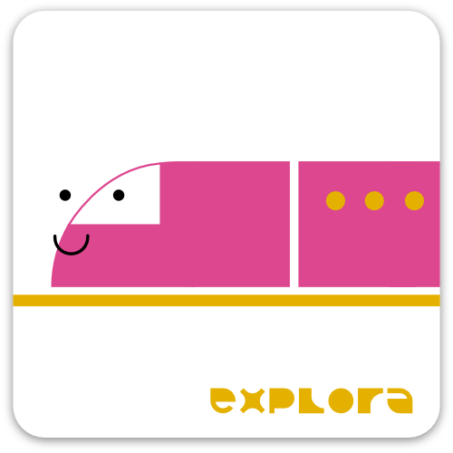
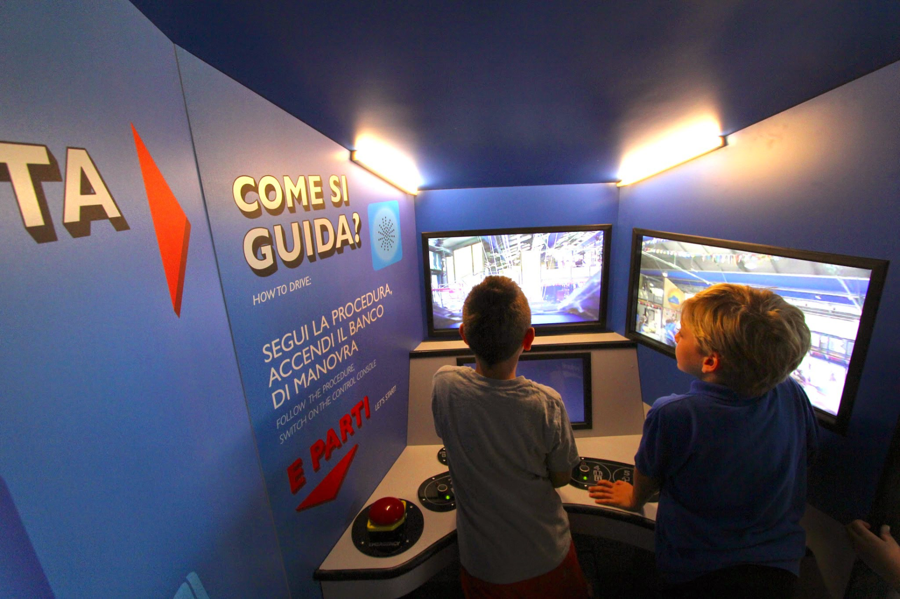

# Next stop explora

 

*Next stop explora* is a an application that emulates some of the functioning of a train cockpit throug a simplified console and simplified outputs.

- [Introduction](#introduction)
- [Development](#development)
- [Project additional infos](#infos)

## Introduction
*Next stop explora* features a physical console that relies on **buttons** and **magnetic sensors** for users inputs and **displays and led strips as output**. The buttons and the sensors on the console are associated to typical actions to be performed as a train driver and influences what happens in the display and the leds behaviour.
The displays feature both video (pre-rendered or a camera output) and images.

## Development
Lorem ipsum dolor sit amet, consectetur adipiscing elit, sed do eiusmod tempor incididunt ut labore et dolore magna aliqua. 

## Project additional infos

### Project purpose
*Next stop explora* is designed to be an installation. A full size train cockpit features a display and a basic console.
 
**Two versions** of the installation have been presented: 
- The first one was displaying a video recorded in real time by a camera placed on topo of small toy train controlled through a reley and activated during “Running” state. The train rails were installed above the installation
area, being visible from all the visitors.
- The second relied on a pre rendered video paused and played accordingly with application states.

### Related Explora's project

- [Il buono prima di tutto]()

